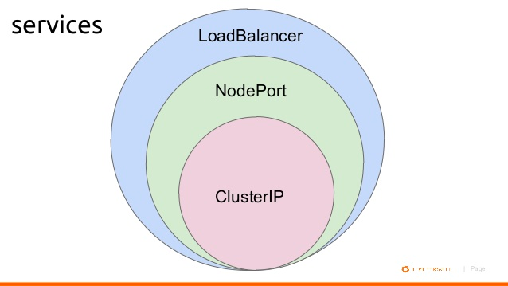

# Services

# create a 3 separate terminal split pane with watch on pods
```s
$ watch kubectl get pods -o wide        #00f7ff
$ watch kubectl get svc                 #69f675
$ watch kubectl get endpoints           #ffeb00
```

### ClusterIP (Only for Internal communication)

```s
$ kubectl apply -f mysql-rs.yaml
$ kubectl apply -f mysql-svc.yaml

$ kubectl apply -f metadata-svc-cip.yaml
$ kubectl apply -f metadata-svc-np.yaml
$ kubectl apply -f metadata-rs.yaml

$ kubectl apply -f hello-svc-np.yaml
$ kubectl apply -f hello-rs.yaml

$ kubectl describe svc <service-name>
$ kubectl describe endpoints <endpont-name>

# goto node and access pod via service (Service can be accessed by DNS from inside the svc )
$ kubectl exec -it <pod-name> -- /bin/bash
$ curl <svc-name>:<port>/meta  
OR
$ wget -qO- <svc-name>:<port>/meta
```

### NodePort (Allow to reach to the node from outside the clustor)
```s

$ minikube ip   # kubernetes ip
$ curl <minikube-ip>:<NodePort-Port>/meta
# run on another node using same port
```


### LoadBalancer, connect to K8S cluster on Cloud Service provider like Digital Ocean
```s
# To Do
```

